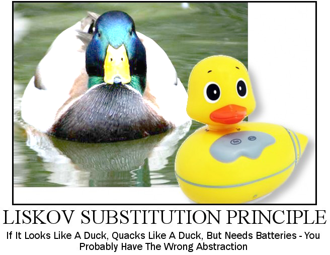

# Açıklamalar

## Çalıştırma
[source,console]
----
npm install
yarn start
----
** Projeyi çalıştırmak için proje klasörü içerisinde yukarıdaki kodları console/terminal üzerinde çalıştırmanız gerekmektedir. 

CAUTION: Bilgisayarınızda npm ve yarn paketlerinin yüklü olduğundan emin olun.

## Liskov Substitution Principle

1988'de Barbara Liskov tarafından yazılan Liskov Substitution ilkesi; temel sınıflara(super class) gönderme yapan fonksiyonlara sahip türetilmemiş (çocuk) sınıflardan üretilen nesneleri, hiyerarşi ilişkisini bilmeden de kullanılabilmesi gerektiğini belirtir.

##### './src/Models/TransportationDevice.js'

[source,javascript]
----
class TransportationDevice
{
    /*
    get engine() {
        return this._engine;
    }

    set engine(value) {
        this._engine = value;
    }
    */
    get speed() {
        return this._speed;
    }

    set speed(value) {
        this._speed = value;
    }
    get name() {
        return this._name;
    }

    set name(value) {
        this._name = value;
    }

    constructor() {
        this._name = "";
        this._speed = 0.00;
        /*this._engine = null;*/
    }

    /*
    //Sorun yaratiyor, cunku bisiklet de bir ulasim aracidir fakat motoru yoktur. Bisikleti de buradan turetemeyecegimiz icin Liskov Substitution prensibine uymamis olur.
    startEngine() { // <1>
        console.log("Engine started.");
        showNotification("","Engine started.","");
    }
    */
}
----

<1> Sorun yaratıyor, çünkü bisiklet de bir ulaşım aracıdır fakat motoru yoktur. Bisikleti de buradan türetip fonksiyonu boş bırakırsak, bu tarz bir tasarım Liskov Substitution prensibine uymamış olur.

##### './src/Models/Bicycle.js'

[source,javascript]
----
class Bicycle extends DevicesWithoutEngines/*TransportationDevice*/ {
    constructor(){
        super();
    }

    startMoving(){
        console.log("Bicycle started to move.");
        showNotification("","Bicycle started to move.","");
    }

    /*
    startEngine(){ //<1>
        //Bos override etmek zorunda kaliyoruz. Bu da problemi olusturuyor.
    }
    */
}
----

<1> Boş override etmek zorunda kalıyoruz. Bu da problemi oluşturuyor.

Bu tarz sıkıntılardan dolayı; bisiklet ve araba objelerini direk 'ulaşım aracı' sınıfından türetmek yerine, motorlu ve motorsuz taşıtlar olmak üzere iki farklı sınıf oluşturuyoruz.
Aşağıda örneklerini görebilirsiniz:

##### './src/Models/DevicesWithEngines.js'

[source,javascript]
----
class DevicesWithEngines extends TransportationDevice{
    get engine() {
        return this._engine;
    }

    set engine(value) {
        this._engine = value;
    }

    constructor(){
        super();
        this._engine=null;
    }

    startEngine() {
        console.log("Engine started.");
        showNotification("","Engine started.","");
    }
}
----

##### './src/Models/DevicesWithoutEngines.js'

[source,javascript]
----
class DevicesWithoutEngines extends TransportationDevice {
    constructor(){
        super();
    }

    startMoving(){
        console.log("Started to move.");
        showNotification("","Started to move.","");
    }
}
----

## Decorator Pattern

### Artılar ve eksiler

[IMPORTANT]
.Artılar
====
* Yeni bir alt sınıf yapmadan bir nesnenin davranışını genişletebilirsiniz.
* Çalışma zamanında bir nesneye sorumluluk ekleyebilir veya bu nesneden sorumlulukları kaldırabilirsiniz.
* Bir nesneyi birden fazla dekoratöre sararak çeşitli davranışları birleştirebilirsiniz.
* _Single Responsibility Principle_. Olası davranış çeşitlerini uygulayan monolitik bir sınıfı birkaç küçük sınıfa bölebilirsiniz.
====

[IMPORTANT]
.Eksiler
====
* Sarmalayıcı(wrapper) yığınından belirli bir sarmalayıcıyı çıkarmak zordur.
* Bir dekoratörü, davranışı dekoratörler yığınındaki sıraya(stack) bağlı olmayacak şekilde uygulamak zordur.
* Katmanların ilk yapılandırma kodu oldukça çirkin görünebilir.
====

##### './src/Models/CarDecorator.js'

[source,javascript]
----
class CarDecorator extends ICar{
    constructor(decoratedCar){ // <1>
        super();
        this.decoratedCar=decoratedCar;
    }

    startEngine(){ // <2>
        this.decoratedCar.startEngine();
    }
}
----

<1> CarDecorator objemize gelecek araba objesini constructor kısmında zorunlu kılıyoruz.
<2> CarDecorator objesinin içerisinde değişken olarak bulunan araba objesinin motor başlatma fonksiyonu çağrılıyor.

##### './src/Models/ElectricCarDecorator.js'

[source,javascript]
----
class ElectricCarDecorator extends CarDecorator{
    constructor(decoratedCar){ //<1>
        super(decoratedCar);
    }

    startEngine() { // <2>
        this.decoratedCar.startEngine();
        console.log("The engine runs silently.");
        showNotification("","The engine runs silently.","");
    }
}
----

<1> Aldığı araba sınıfına sahip objeyi ust sınıf olan CarDecorator objesinin constructor kısmına iletiyor.
<2> CarDecorator objesinin startEngine fonksiyonunu override ettiğimiz kısım burası.

##### './src/Models/PetrolCarDecorator.js'

[source,javascript]
----
class PetrolCarDecorator extends CarDecorator{
    constructor(decoratedCar){ //<1>
        super(decoratedCar);
    }

    startEngine() { // <2>
        this.decoratedCar.startEngine();
        console.log("The engine runs loudly.");
        showNotification("","The engine runs loudly.","");
    }
}
----

<1> Aldığı araba sınıfına sahip objeyi ust sınıf olan CarDecorator objesinin constructor kısmına iletiyor.
<2> CarDecorator objesinin startEngine fonksiyonunu override ettiğimiz kısım burası.
